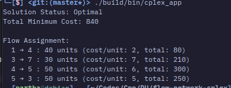

# CPLEX Network Flow Solver
[![C++ Version][cpp-image]][cpp-url]
[![CMake Version][cmake-image]][cmake-url]
[![CPLEX Version][cplex-image]][cplex-url]

A minimum‑cost network flow solver built with IBM CPLEX. This project models a directed graph with multiple sources and sinks, and computes the cheapest way to ship a given supply to meet demand using CPLEX's optimization libraries in C++. This project was created for an academic course.

> [!WARNING]
> This project was created on VSCode, so the project files may not match with the ones provided by the CPLEX IDE.

## Installation

### Linux
1. **Download CPLEX**: Follow the instruction provided by **Tushar sir** to download and install CPLEX on your system.
2. **Make Installer Executable**
   ```bash
   chmod +x cplex_studio2211.linux_x86_64.bin
   ```
3. **Run Installer**
   ```bash
   ./cplex_studio2211.linux_x86_64.bin
   ```
4. **Set Environment Variables**
   ```
   export CPLEX_HOME="/opt/ibm/ILOG/CPLEX_Studio2211/cplex"
   export LD_LIBRARY_PATH="${CPLEX_HOME}/lib/x86-64_linux/static_pic:${LD_LIBRARY_PATH}"
   ```

### Windows and MacOS
Follow the [CPLEX installation instructions][cplex-url]. Good luck with the installation process!

## Troubleshooting

CPLEX installation may fail in linux (failed for me in both `fedora` and `debian`) due to executable stack requirement.

#### Workaround:
Install the `execstack` package from the official repository.

```bash
sudo dnf install execstack
```

or

```bash
sudo apt install execstack
```

After installing `execstack`, run the following command in one terminal:

```bash
while true; do
  sudo find /tmp -path "*install.dir.*" -name libj9vm29.so \
    -exec execstack -c {} \; 2>/dev/null
  sleep 0.2
done
```

now run the installer command in another terminal. After the installation is complete, press `Ctrl+C` to stop the loop in the first terminal.

## Usage
### Build the solver
```bash
cmake -S . -B build
cmake --build build
```
### Run the solver
```bash
./build/bin/cplex_app
```

## Prebuilt Binary
A prebuilt binary for the project can be found [here](https://github.com/Partha11/flow-network-cplex/releases/tag/v0.0.1). You can download the binary to test the project. The binary is compiled using the latest version of CPLEX (22.1.1). It should run without installing the CPLEX libraries on your machine.

## Output

The screenshot above shows the solution for the 7-node lubricant flow problem. The solver outputs:

- Optimal flow quantities for each edge
- Total minimum cost of shipment



### Solution:

#### Flow Assignment:

| From | To | Quantity | Cost/Unit | Total Cost |
|------|----|----------|-----------|------------|
| 1    | 4 | 40       | 2          | 80         |
| 3    | 7 | 30       | 7          | 210        |
| 4    | 5 | 50       | 6          | 300        |
| 5    | 3 | 50       | 5          | 250        |

The total cost of shipment is **840**.

<!-- Badges & links -->
[cplex-image]: https://img.shields.io/badge/CPLEX-22.1.1-blue?style=flat-square
[cplex-url]: https://www.ibm.com/products/ilog-cplex-optimization-studio
[cpp-image]: https://img.shields.io/badge/C++-17-00599C.svg?style=flat-square&logo=cplusplus
[cpp-url]: https://isocpp.org/
[cmake-image]: https://img.shields.io/badge/Cmake-3.25.1-064F8C.svg?style=flat-square&logo=cmake
[cmake-url]: https://cmake.org/
[cplex-docs-url]: https://www.ibm.com/docs/en/icos/<version>/CPLEX/installation